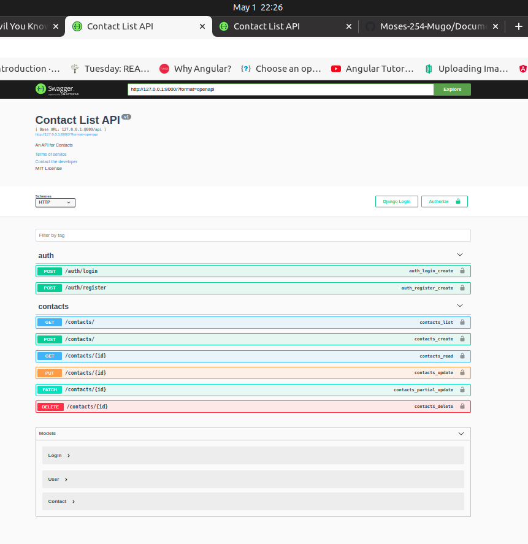

# Documented-API-Con_List
## Contributors
* Fell free to comment, critique or even submit a pull request

## Author
Mugo Moses

## Description
Documenting API app

## Screenshots
<!--  -->

## Setup Instructions:
 ### Requirements
 1. Clone the repository by running
            

        git clone https://github.com/Moses-254-Mugo/Documented-API-Con_List.git
    Navigate to the project

        cd CONTACT-APP-API
 2. Create a virtual enviroment

         pipenv --python python3  

    To activate the created virtual environment, run

        pipenv shell

3. Create database
    You will need to create a new postgress database by typing the following command to access postgress

        $ psql

    Then run below query to create a new database named gallery

        # CREATE DATABASE contactapidb;

5. Create Database migrations
    make migrations on postgres using django

        python3 manage.py makemigrations garage
    then run the below command.

        python3 manage.py migrate

6. Run the app
    To run the application on your development machine,

        pythong3 manage.py runserver
### Running Tests
To run tests;

        python3.8 manage.py test
## Techonogies Used
* Phthon3.8
* Django

## Support and contact details
If you have any question, want to contribute to the code? Please email me at 
moseskinyua12@gmail.com
## License
The project is under[MIT License](LICENSE).